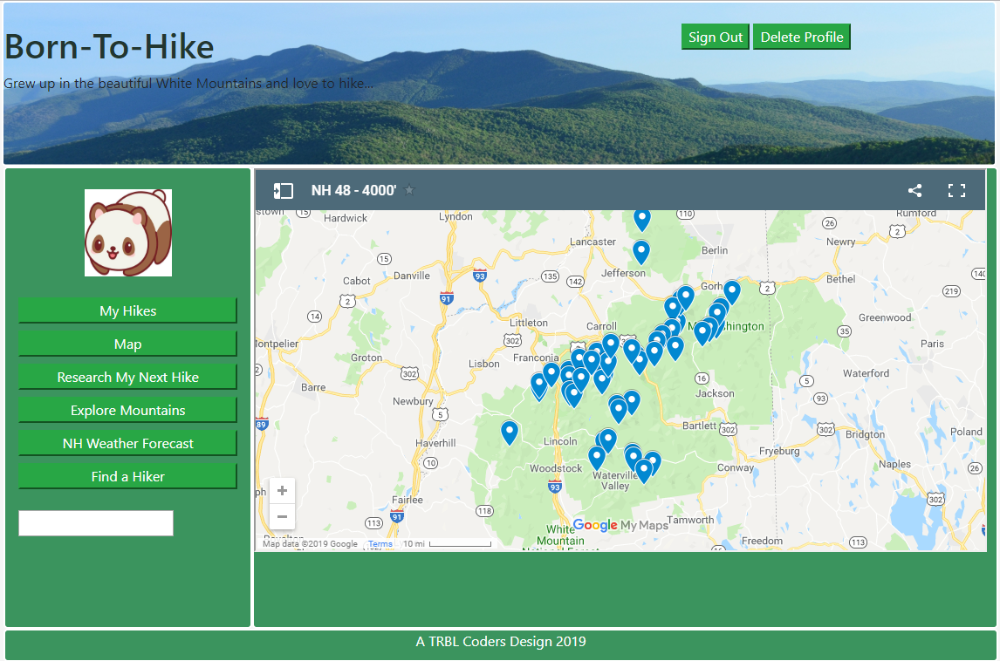

# Take-a-Hike
(UNH Full Stack Developer Boot Camp Projetc 2)

### Project Description:
The state of New Hampshire has forty-eight magnificient 4,000 footer mountains (mostly in the White Mountains). A 4,000 footer is a mountain that has an elevation of at least 4,000 feet and a minimum of 200 feet prominence. All criteria is determined by the Appalachian Mountain Club (AMC). HIkers can even earn a hiking patch for hiking all 48 of the New Hampshire 4,000 Footers, also known as the NH48. Take-a-Hike is as a tool to help hikers track their progress on the NH48, share their adventures with others, and plan future hikes.

### Team:
TRBL Codes consists of five individuals who have recently completed 16 weeks of a 24 week full stack development bootcamp. The team was brough together much like Frodo and The Fellowship of the Ring the whim of our class Instructor Blake and our TA Mason. Our Fellowship includes:\
*Cheyra Dickinson\
*Diane Schiavo\
*Mark Loughran\
*Stan Mozolevskiy\
*Jeff Bond

### Rough Breakdown of Tasks:
-Simple flexible front end and main menu that will allow rapid MVP and ease of introducing new features.\
-Hiker Management including Sign Up with a profile, Sign In, Delete Profile.\
-A list of the NH48 mountains used to track Hikes.\
-My Hikes - Used to track a Hiker progress towards completing the NH48.\
-Map -Allows the Hiker to view all NH48 mountains on a googlemaps for planning purposes.\
-Research My Next Hike - Allows the Hiker to view information about a specific mountain for planning their next hike.\  
-NH Weather Forecast - Allows Hikers to view pending weather forecast to help with planning their hikes.\
-Find a Hiker -  Allows a HIker to locate another HIker and view their hike information.

### Demo the Site:
The site can be viewed on Heroku [here](https://boiling-savannah-54771.herokuapp.com/)

### Prerequisites:
-A modern browser and an internet connection. Chrome works best, but others should be fine too.\
-A modern IDE - it was developed using Visual Studio Code, but any text editor would work, including notepad.\
-GitHub.\
-GitBash installed locally.

### Getting Started Locally:
To get started
1. Find a Locate an empty directory on your hard drive
2. Open a bash terminal in that directory
3. Clone the Project 2 from GitHub using Git
4. Set up your node js environment by running npm install
5. Establish a local mysql database by running the take_a_hike_schema.sql
6. Update the config files to reflect your database name, user name, and password
7. Run node server
8. In your browser go to localhost:3000

### Technologies Used:
*Bootstrap 4 (Front-end framework)\
*Express.js (Server framework)\
*Handlebars (Templating engine)\
*Heroku (Cloud platform)\
*JawsDB (Heroku database add-on)\
*MySQL (RDBMS)\
*Node.js (Javascript environment)\
*Sequelize (ORM)\
*Googlemaps API